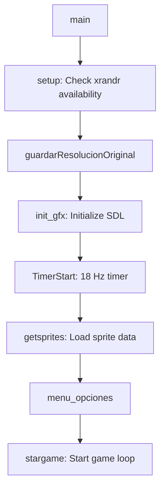
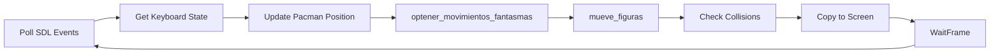

## Introduction

The Pacman game is built using C with SDL 1.2 for graphics rendering. The architecture follows a modular design with clear separation between graphics, game logic, sprite management, and input handling.

## Core modules

The codebase is organized into distinct functional modules:

### Main entry point

**src/main.c** - Application lifecycle management
- Command-line argument parsing (`-f` for fullscreen, `-w` for windowed)
- Resolution backup and restoration using GLFW and xrandr
- Game initialization and cleanup orchestration

### Graphics engine

**src/gfx.c** - SDL graphics subsystem
- SDL initialization and video mode setup (320x200x32)
- Screen buffer operations and double-buffering
- Image loading and blitting
- Timer management for game loop synchronization

### Sprite management

**src/sprites.c** - Sprite definitions and loading
- Static sprite data for all game characters
- Sprite coordinate definitions from sprite sheet
- Number rendering sprites (0-9)

**src/misc.c** - Sprite loading and utilities
- `getsprites()` - Loads all sprites from data/sprites.bmp
- Array management for maze layout
- Structure initialization for game entities

### Game logic

**src/mov_fig.c** - Character movement and rendering
- Pacman movement with smooth interpolation
- Ghost rendering with state-based sprite selection
- Collision detection between Pacman and ghosts

**src/movefant.c** - Ghost AI pathfinding
- Ghost movement decision algorithm
- Target position calculation
- Pathfinding with randomization

**src/fantasma.c** - Ghost sprite definitions
- Raw sprite data for four ghost colors (red, blue, yellow, gray)
- Sprite data for scared and dead states

### Input and menu

**src/teclado.c** / **misc.c:teclado()** - Keyboard input handling
- Arrow key detection and processing
- Pacman direction control
- Game state updates based on input

**src/menuopt.c** - Menu system
- Options menu rendering
- Game start/restart logic

## Data structures

The game uses two primary structures defined in **src/include/misc.h**:

<Tabs>
  <Tab title="struct pcman">
    ```c
    struct pcman {
      float x;              // Current X position (grid coordinates)
      float y;              // Current Y position
      float inc_x;          // X increment (-1, 0, 1)
      float inc_y;          // Y increment
      float old_inc_x;      // Previous X increment
      float old_inc_y;      // Previous Y increment
      float old_x;          // Previous X position
      float old_y;          // Previous Y position
      float yf;             // Temporary Y calculation
      float dir;            // Direction index
      int puntos;           // Remaining dots to collect
      int puntuacion;       // Player score
      int nivel;            // Current level (0-13)
      int tiempo;           // Power-up timer
      int estado_pcman;     // State: NORMAL or ENFADADO
      int num_vidas;        // Lives remaining
    };
    ```
  </Tab>
  <Tab title="struct fantasmas">
    ```c
    struct fantasmas {
      float x[4];           // X positions for 4 ghosts
      float y[4];           // Y positions
      float old_x[4];       // Previous X positions
      float old_y[4];       // Previous Y positions
      float inc_x[4];       // X increments
      float inc_y[4];       // Y increments
      float find_x[4];      // Target X positions
      float find_y[4];      // Target Y positions
      float find_xp[4];     // Predicted target X
      float find_yp[4];     // Predicted target Y
      float old_mov_x[4];   // Previous movement X
      float old_mov_y[4];   // Previous movement Y
      int estado_fantasma[4]; // Ghost state per entity
      int who;              // Current ghost being processed
    };
    ```
  </Tab>
</Tabs>

## Data flow

The game follows a traditional initialization -> game loop -> cleanup pattern:

### Initialization phase



From **src/main.c:160-196**:

```c
int main(int argc, char **argv)
{
  setup();
  int ch;
  sdl_flags = (SDL_SWSURFACE | SDL_HWPALETTE | SDL_DOUBLEBUF);
  
  while ((ch = getopt(argc, argv, "fw")) != -1)
    switch (ch)
    {
    case 'f': /* fullscreen */
      sdl_flags = (SDL_SWSURFACE | SDL_HWPALETTE | SDL_DOUBLEBUF | SDL_FULLSCREEN);
      break;
    case 'w': /* ventana */
      sdl_flags = (SDL_SWSURFACE | SDL_HWPALETTE | SDL_DOUBLEBUF);
      break;
    }

  guardarResolucionOriginal();
  init_gfx();
  TimerStart(timerfunc, 18);
  getsprites();
  menu_opciones(TRUE);
  stargame(&fan, &pc, COMENZAR);
  restaurarResolucionOriginal();
  
  exit(0);
}
```

### Game loop

The main game loop is in **misc.c:teclado()** (lines 506-914):



Key functions called per frame:
1. **Input processing** - SDL keyboard state polling
2. **Ghost AI** - `optener_movimientos_fantasmas()` calculates ghost targets
3. **Movement** - `mueve_figuras()` updates positions and renders sprites
4. **Collision detection** - Checks Pacman vs Ghost collisions in mov_fig.c:191
5. **Rendering** - Blits background buffer to screen surface

### Cleanup phase

From **src/main.c:193**:

```c
restaurarResolucionOriginal();
exit(0);
```

The `atexit(SDL_Quit)` handler registered in gfx.c:27 ensures SDL cleanup.

## Key constants

Defined in **src/include/defines.h**:

<ParamField path="RES_X" type="int" default="320">
  Screen width in pixels
</ParamField>

<ParamField path="RES_Y" type="int" default="200">
  Screen height in pixels
</ParamField>

<ParamField path="DEPTH" type="int" default="32">
  Color depth in bits per pixel
</ParamField>

<ParamField path="MAXX_A" type="int" default="32">
  Maze array width (including borders)
</ParamField>

<ParamField path="MAXY_A" type="int" default="26">
  Maze array height
</ParamField>

<ParamField path="ESCALA" type="int" default="8">
  Grid cell size in pixels
</ParamField>

<ParamField path="NUM_GHOTS" type="int" default="4">
  Number of ghosts in the game
</ParamField>

<ParamField path="NUM_PUNTOS" type="int" default="226">
  Total dots to collect per level
</ParamField>

## Memory layout

### Background buffer

From **src/main.c:22**:

```c
UintDEP background[RES_XB * RES_YB * BPP];
```

This is the main rendering target - a 320x200x4 byte buffer (256,000 bytes) used for double-buffering.

### Maze array

From **src/misc.c:17-45**, the maze is a static 32x26 integer array representing:
- `C` (1) - Circuit/walkable path with dot
- `N` (2) - Nothing/walkable path without dot
- `J` (3) - Path already walked
- `P` (4) - Door (ghost house entrance)
- `B` (5) - Power pellet

<Note>
The maze array uses value 0 for walls and non-walkable areas. The collision detection in movefant.c uses `truex()` and `truey()` helper functions to check if a position is walkable.
</Note>

## Performance considerations

### Frame timing

The game uses a fixed 18 Hz timer (src/main.c:188) for game logic updates, while rendering runs at 50 FPS (FRAMES_PER_SEC in gfx.h:2).

### Smooth movement

Character movement uses incremental pixel offsets with velocity arrays:
- **velocidades[14]** - Ghost speed per level (0.4 to 0.7, defined in misc.c:140-155)
- **inc_velocidad_pc** - Pacman speed (0.5, misc.c:173)

This allows sub-pixel movement for smooth animation between grid cells.

### Sprite rendering

The `putico()` function (gfx.c:142-152) uses `memcpy()` for fast sprite blitting:

```c
void putico(int x, int y, UintDEP *source, UintDEP *dest, int tx, int ty)
{
    UintDEP *src_line = source;
    UintDEP *dst_line = dest + y * 320 + x;

    for (int sy = 0; sy < ty; sy++) {
        memcpy(dst_line, src_line, tx * sizeof(UintDEP));
        src_line += tx;
        dst_line += 320;
    }
}
```

## Build system

The project uses a Makefile to compile all source files and link against SDL libraries:
- SDL 1.2
- SDL_image
- GLFW3 (for monitor detection)

<Accordion title="Compiler flags">
  Typical compilation requires:
  - `-lSDL`
  - `-lSDL_image`
  - `-lglfw`
  - `-lm` (math library)
</Accordion>